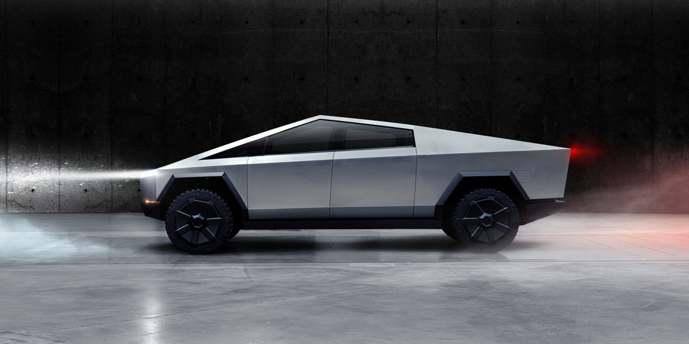

## The Future of Transportation and Tesla

Tesla made into headlines past week thanks to its unorthodox approach to electric
vehicles: Cybertruck, a electric pickup truck. 

It's hard to look to this automobile without noticing its pointy and
straight design. Its presentation caught people's attention also because while
Tesla CEO (Elon Musk) described its unbreakable windows, a man armed with a 
hammer hit the truck's window to show its resistance to impact. To everyone's
surprise, the window shattered right in front of the CEO, who noted: "But it
didn't go through."

While some people might think that Tesla's reputation could be damaged, its image
as the symbol of the future of locomotion is still very much intact. Why is that 
true? Why is Tesla so special? And why could it build one of the most important
aspects of our future?

***

Fossil fuel's days are numbered. As a non-renewable source of energy, there's no
way for the humanity to keep using it forever. One day the oil reserves will
be scarce, and without an alternative, humanity will face an horrible fate. 
Also, burning fossil fuels releases carbon dioxide, a greenhouse effect gas, 
which may contribute to global warming, changing our planet as we know it forever.
According to *United States Environmental Protection Agency*, transportation
releases 29% of greenhouse emissions. Changing the way we fuel our daily
commuting is crucial to protect Earth.

While there are other interesting renewable sources of energy to fuel our cars
(such as hydrogen cells, ethanol, and biodiesel) one of the most promising 
options are **EV** (Electrical Vehicles), which can easily be charged by renewable
electric sources (wind, solar, or hydroelectric power). But why haven't the 
EVs taken over the world?

***

The history of EVs is actually old, being first invented in around 1830s. However,
due to technological limitations it was surpassed by gasoline-fueled cars. Believe or 
not, famous car manufatures produced electric cars in 1990s, such as Chrysler, Ford and
Honda. However, the automakers were accused of making half hearted attempts just to
satisfy California Air Resources Board, which was pushing companies to invest in cleaner
vehicles. However, the technology wasn't still the best, with inefficient batteries and
electrical circuits, the cars couldn't get much far compared to normal cars.

However, as technology advanced to make EVs more efficient, such vehicles started
to become more than a concept, introducing many relevant cars, like Nissan Leaf.
However, charging EVs in you normal 110/220V outlet is a nightmare, taking 
more than 10 hours to fully charge. Problems with charging infrastructure scared
many consumers.

***

What makes Tesla special is that it is not only a automotive company, but also a 
energy company, developing better batteries and more ways to make EVs convenient,
such as proprietary charging stations, energy generating solar panels, and huge
batteries to store electric energy in. Also, its first EV models are rather 
expensive (The Roadster cost more than US$100,000), which helps as a test
to create cheaper models aimed to larger markets while still offering a high
performance car.

In conclusion, while other automakers are now willing to move towards a new
way to fuel our lives, Tesla caught everyone's attention paying close
attention to charging infrastructure and offering a very high quality product,
even with some accidents taking place sometimes.